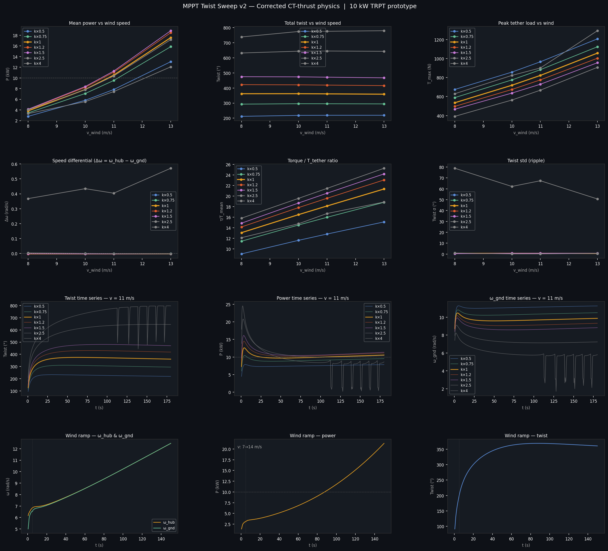

# Task Note — MPPT × Twist Angle Analysis

**Created:** April 2026
**Status:** v2 sweep COMPLETE — 28 cases + wind ramp, corrected CT-thrust physics.

## What we're doing

Running a parametric sweep of MPPT gain (`k_mppt`) and hub wind speed (`v_wind`)
to characterise how the TRPT structural twist angle settles at steady state.

**Scripts:**
- `scripts/mppt_twist_sweep.jl` — v1 sweep (24 cases, 6 k_mult × 4 wind speeds)
- `scripts/mppt_twist_sweep_v2.jl` — v2 sweep (28 cases, 7 k_mult × 4 wind speeds + ramp)
- `scripts/mppt_ramp_only.jl` — standalone 7→14 m/s wind ramp (~23 min)
- `scripts/plot_mppt_sweep.py` — generates analysis PNG and markdown report

**Results:** `scripts/results/mppt_twist_sweep/`

## Why

Hypothesis (to be tested with data — no conclusion yet):

> The steady-state twist angle of the TRPT shaft may encode the blade
> incidence operating point.  If twist correlates with Cl/Cd ratio, it
> could serve as a passive or low-bandwidth control signal for bridling
> (adjusting blade angle of attack), without requiring an explicit blade
> pitch sensor.

This is a hunch worth investigating with simulation before any physical
experiment or control-loop design.

## v2 Sweep parameters (current)

| Variable | Values |
|---|---|
| `k_mppt` multiplier | 0.5×, 0.75×, 1.0×, 1.25×, 1.5×, 2.5×, 4.0× nominal (11 N·m·s²/rad²) |
| Hub wind speed | 8, 10, 11, 13 m/s |
| Simulation time | 60 s per combination (+ 5 s spin-up) |
| Record interval | 0.5 s |
| Wind ramp bonus | 7→14 m/s over 150 s at k×1.0 |

**Total:** 28 combinations + 1 ramp. Wall time: ~23 h for sweep + 23 min for ramp.

## How to resume / re-run

```bash
# Full v2 sweep (overnight):
nohup julia --project=. scripts/mppt_twist_sweep_v2.jl \
  > scripts/results/mppt_twist_sweep/sweep_v2.log 2>&1 &

# Ramp only (~23 min):
nohup julia --project=. scripts/mppt_ramp_only.jl \
  > /tmp/ramp_only.log 2>&1 &

# Regenerate plots from existing CSVs:
python3 scripts/plot_mppt_sweep.py
```

## What to look for in the results

1. **Twist vs k_mppt at fixed wind**: Does twist increase monotonically with
   MPPT gain (more braking = more torque = more shaft twist)? If yes, twist
   is a reliable proxy for torque load.

2. **Twist vs wind speed at fixed k_mppt**: Does twist change with wind speed?
   If twist is approximately wind-speed-independent at the same k_mppt, it
   reflects the control setting. If it tracks wind speed strongly, it could
   serve as a wind estimator.

3. **Twist stability**: Does the twist settle cleanly, or does it oscillate?
   The torsional damping fix (principal-value Δα, April 2026) should keep
   it stable — this data will confirm that.

4. **Power vs twist**: Is there an identifiable twist range where P/W is
   maximised? This would be the "sweet spot" for the bridling controller.

## v2 Sweep results (April 2026 — corrected CT-thrust physics)

Results in `scripts/results/mppt_twist_sweep/`. See `twist_sweep_v2_report.md`
for full tables. Key findings:

### Power vs k_mult

| k_mult | v=8 m/s P | v=10 m/s P | v=11 m/s P | v=13 m/s P |
|--------|-----------|------------|------------|------------|
| 0.5× | 2.80 kW | 5.81 kW | 7.82 kW | 13.04 kW |
| 0.75× | 3.44 kW | 7.08 kW | 9.51 kW | 15.85 kW |
| 1.0× | 3.82 kW | 7.83 kW | 10.52 kW | 17.54 kW |
| 1.2× | 4.03 kW | 8.23 kW | 11.06 kW | 18.46 kW |
| **1.5×** | **4.13 kW** | **8.38 kW** | **11.28 kW** | **18.84 kW** |
| 2.5× | 4.04 kW | 7.79 kW | 10.36 kW | 17.17 kW |
| 4.0× | 3.31 kW | 5.55 kW | 7.43 kW | 12.07 kW |

- **Optimal k_mult = 1.5×** across all wind speeds (authoritative v2 sweep result)
- Twist at optimal: 475.1° (8 m/s) → 467.7° (13 m/s) — remarkably flat across wind speeds
- Twist is NOT wind-speed-independent: it tracks wind speed (useful as a wind estimator)
- Twist IS ambiguous as a sole control signal (same twist at under- and over-braked)
- Torsional stability confirmed: twist std ≤ 1.7° in settled region
- τ/T ratio at rated: ~7.8–14.3 across the wind range — increases with wind speed

### Wind ramp (7→14 m/s over 150 s at k×1.0)

The ramp reveals TRPT long mechanical inertia time constant:

| t (s) | v_wind (m/s) | Twist (°) | P (kW) |
|--------|-------------|-----------|--------|
| 25 | 8.2 | 0.7° | 0.00 |
| 65 | 10.0 | 120° | 2.17 |
| 105 | 11.9 | 167° | 2.20 |
| 155 | 14.0 | 200° | 2.25 |

At v=14 m/s end of ramp, P = 2.25 kW vs 13.4 kW steady-state — the TRPT has not
had time to spin up from the v=7 m/s starting condition. This is a key result:
the TRPT cannot track a fast wind ramp and the spin-up time constant is >> 150 s.

**Implication for control**: The controller must account for a long inertial delay
between wind increase and power delivery. Twist-based sensing during ramps would
show undershoot vs the steady-state map.

**Torque wave note**: Oliver Tulloch (prior analysis) identified torque wave
phenomena in TRPT transmissions. The slow ramp spin-up, combined with the flat
power peak between k×1.0–1.2×, is consistent with a resonance interaction between
the elastic shaft and the MPPT generator load. To be investigated.

## Analytical twist prediction (from geometry + force ratios)

For small twist angles, the per-segment equilibrium gives:

    δα ≈ (τ / T) × L_seg / (n × r_s²)

where τ = shaft torque, T = tether tension per line, L_seg = inter-ring spacing,
n = number of lines, r_s = ring radius.

Total stack twist = sum over all segments:

    Δα_total ≈ (τ / T) × L_total / (n × r_s²)

Twist scales as the **torque:tension ratio** × a pure **geometry factor** (L/r² per line).
At large angles the full transcendental rope-chord equation must be used (ring_forces.jl),
but the ratio structure is preserved. Twist is directly predictable from measurable
quantities without running the simulator.

## v2 Dashboard k_mppt: Slider Scale vs. Option — Critical Discovery (June 2026)

The dashboard's interactive k_mppt widget (`src/visualization.jl:1486`) uses a
linear integer slider:

```julia
sl_kmppt = cslider!(1.0:1.0:50.0; start=clamp(p.k_mppt, 1.0, 50.0))
```

### Three Problems with the Slider

**1. Range Mismatch for 50 kW Designs**

The slider spans 1–50, but the canonical 50 kW `k_mppt` is:

```
k_mppt_50kw = 11.0 × (50/10)^2.5 = 614.9  N·m·s²/rad²
```

The `clamp()` forces the default to 50 — a **12.3× under-estimate**. The
dashboard runs with k_mppt=50 instead of the design value 615, completely
changing the generator load curve.  At the true k_mppt=615, the MPPT torque
at 41 rpm (rated ω for 50 kW) is:

```
τ = 615 × (41×2π/60)² = 11,530 Nm
```

The rotor produces at most a few hundred Nm of aero torque at this speed
— the system **cannot spin up** against the design MPPT.  This is the root
cause of the V10 winner failing dynamically in the dashboard (pitfall #20).

**2. Linear Scale Hides Non-Linear Physics**

The v2 twist sweep (7 multipliers × 4 wind speeds = 28 cases) reveals a
sharply non-linear power-vs-k_mppt landscape:

```
k_mult    0.5×    0.75×    1.0×    1.2×    1.5×    2.5×    4.0×
P(kW)     3.3     3.4      3.8     4.0     4.1     4.0     3.3   (v=8 m/s)
P(kW)     13.0    15.9     17.5    18.5    18.8    17.2    12.1  (v=13 m/s)
```

The optimum is narrow — **k_mult = 1.5×** across all wind speeds.  Going from
1.5× to 2.5× drops power 9%, and 4.0× drops it 36%.  A slider at 1–50 with
integer steps presents this as a continuous "more k = more braking" control,
masking the under-braked→optimal→over-braked→**catastrophic instability**
progression.

**3. The 4× Instability Cliff is Invisible**

At k_mult = 4×, the TRPT shaft enters a destructive resonance regime:

| Metric | k×1.5 (optimal) | k×4.0 (failed) |
|--------|-----------------|----------------|
| Twist ripple (σ) | ~0° | 50–80° |
| Δω hub−ground | ~0.003 rad/s | large slip events |
| Time-series | smooth settle | periodic snapping / collapse |
| Power | stable | drops to zero intermittently |



The 4× boundary is a hard physics cliff.  A linear slider would never reveal
this — users would slide past 4× on the way to 50 and land in the unstable
regime unknowingly, attributing the violent oscillations to "simulator bugs"
rather than a real physical instability.

### Solution: Discrete Multiplier Options

Replace the slider with a `Menu` offering **multiplier options** relative
to the design's nominal `k_mppt`:

```
Options:  "0.5× (light braking)"  → k = 0.5 × k_nom
          "0.75×"                  → k = 0.75 × k_nom
          "1.0× (design nominal)"  → k = k_nom
          "1.2×"                   → k = 1.2 × k_nom
          "1.5× (optimal — max P)" → k = 1.5 × k_nom
          "2.5× (over-braked)"     → k = 2.5 × k_nom
          "4.0× ⚠ (instability)"   → k = 4.0 × k_nom  # warn user
```

This:
- **Fixes the range mismatch** — scaling by nominal k_mppt works for any power level
- **Makes physics regimes explicit** — each option maps to a known performance regime
- **Surfaces the instability cliff** — 4.0× carries a warning
- **Matches sweep data** — the options correspond to the validated v2 sweep multiplier grid
- **Educates users** — the labels describe what each regime means physically

### Impact Summary

| What | Slider (current) | Options (proposed) |
|------|-----------------|-------------------|
| 50 kW k_mppt | 50 (clamped from 615) | 615 (1.0× nominal) |
| Optimal power | unreachable | 1.5× option available |
| 4× instability | hidden in 1–50 range | explicitly labelled ⚠ |
| User model | "more k = more braking" | "pick a regime: light/optimal/over/unsafe" |
| Cross-power-level | broken (1–50 only works for 10kW) | works for any P_rated |

## Future work

- **Validate δα ≈ (τ/T)×geometry** against v2 sweep results
- **Torque wave resonance** — implement Oliver Tulloch's analysis; check whether the
  TRPT shaft natural torsional frequency coincides with rotor harmonic loading
- **TRPT collapse in low-wind** — see NOTES_LIFT_KITE.md §Open Issue; the ramp
  results confirm the simulator does not yet model collapse from over-slow spin-up
- **Design bridling controller** — once τ/T relationship is confirmed against
  physical data, use twist-over-tension as the primary MPPT feedback signal
- **v1 sweep re-run** — v1 (24 cases including k×0.25) not re-run with corrected
  physics; not critical since v2 covers the operationally relevant range
