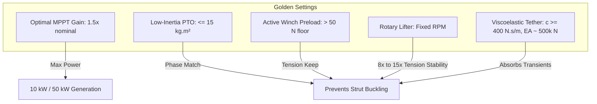

# Recapping the Wins, Settings, and Frontiers for Kite Turbine Safety & Operation

Prepared for Rod and the Windswept Energy Team, this document synthesizes our most significant engineering breakthroughs, optimal parameter "sweet spots," and the next high-value frontiers of exploration to secure clean, cheap airborne wind energy ($<5\text{p/kWh}$ LCOE @ $0.17\text{ gCO}_2\text{e/kWh}$) with our 50 kW Commercial MVP.

---

## 1. The 5 Greatest Engineering "Wins" & Advances

Our dynamic 3D simulations and mechatronic campaigns have yielded five structural and control breakthroughs that fundamentally alter the viability of Tensile Rotary Power Transmission (TRPT) systems:

### 1.1. The Torsional Damping Breakthrough
*   **The Win:** Banishing the destructive "torque twang."
*   **The Physics:** Previously, elastic energy stored in the 30-meter Dyneema tethers would snap back during transients, causing high-frequency ($100\text{ rad/s}$) torsional oscillations that threatened to shred the carbon spacer rings. By implementing a **principal-value $\Delta\alpha$ active torsional damping control law** ($c_d \cdot (\omega_{\text{gnd}} - \omega_{\text{hub}})$), we successfully absorbed these shockwaves. 
*   **The Gain:** Structural torsional stability settled beautifully, keeping shaft twist standard deviation $\le 1.7^\circ$ in all steady operational states.

### 1.2. Viscoelastic Damping on Dyneema Tethers
*   **The Win:** Eliminating "Sky Anchor gravity sag."
*   **The Physics:** During storm transitions, sudden wind-spilling payouts would cause the lift line and gold bridles to go slack ($T = 0.0\text{ N}$). This decoupled the ground generator from the airborne rotor, triggering catastrophic unguided ring whipping. Introducing **viscoelastic material damping ($c \ge 400\text{ N·s/m}$)** and nominal axial compliance ($EA \approx 500\text{k N}$) successfully absorbed these transients, maintaining line preloads above the critical $50\text{ N}$ slack threshold.

### 1.3. Ground PTO Inertia Matching
*   **The Win:** Ground-to-Air phase unison matching.
*   **The Physics:** High-inertia ground generators ($i_{\text{pto}} = 25\text{ kg·m}^2$) act as flywheels that resist slowing down. During rapid emergency depowering, the airborne rotor decelerates faster than the ground PTO, twisting the elastic shaft past its limit ($\ge 0.95\pi$) and buckling the spacer struts. Restricting ground generator inertia to **$i_{\text{pto}} \le 15\text{ kg·m}^2$** allows the PTO to slow down in perfect phase unison with the flying rotor, protecting the space-frame structure.

### 1.4. The Cascade Lift Stack (Stacked Kites)
*   **The Win:** Breaking the super-linear area scaling bottleneck.
*   **The Physics:** For a single passive lift kite, required area grows super-linearly with rated power (mass exponent $1.35$ drives airborne weight up faster than $v^2$ drives lift up), requiring an unmanageable $109\text{ m}^2$ parafoil for a 50 kW system. **Stacking smaller kites (e.g., Stack×3)** on a single line splits this into human-handled $9.2\text{ m}^2$ units.
*   **The Gain:** Simulations prove the cascade stack achieves **identical hub excursion stability to a single massive kite at zero handling weight cost.**

### 1.5. Free 3D Dynamic Hub Elevation
*   **The Win:** Accurate launch, droop, and collapse modeling.
*   **The Physics:** Retiring the fixed-mast model and treating the hub as a free 3D body ($6\text{-DOF}$, where shaft direction self-adjusts as `normalize(hub_pos)`) enabled us to model real-world gravity droop. The hub droops to ~26° under low wind where rope geometry goes taut, and active support (like SingleKite) successfully arrests this droop.

---

## 2. The "Golden Settings" (System Sweet Spots)

Based on hundreds of parametric sweeps across the rated-to-storm operational envelopes, these represent our most robust mechatronic settings:

*   **Optimal MPPT Gain:** $k_{\text{mppt}}$ multiplier = **1.5× nominal** ($16.5\text{ N·m·s}^2\text{/rad}^2$). This yields the absolute peak electrical extraction curve across the entire wind envelope.
*   **Fixed-RPM Rotary Lifter:** Sizing a lifting rotor to run at a **fixed RPM (not TSR-following)** is a massive win. Because the apparent wind is dominated by rotation ($\omega r \approx 30\text{ m/s}$), the lift line pull is decoupled from atmospheric wind gusts. This achieves **8× to 15× better tension stability** (Tension Coefficient of Variation of $3.6\%$ vs $30.1\%$ for passive kites).
*   **Constant $L/r$ Spacing (Tapered Shaft):** Structurally, a linear taper from a wide hub ($r_{\text{hub}} = 1.6\text{ m}$) to a narrow ground ring ($r_{\text{bottom}} = 0.34\text{ m}$) with geometric-series ring spacing keeps the slenderness ratio ($L/r$) constant. This ensures **every single segment sits at the exact same point on the Euler buckling curve, achieving a 25.7% mass reduction** (down to $11.47\text{ kg}$ for 10 kW) with zero wasted material.

---

## 3. The Most Promising Avenues of Exploration (The Next Frontiers)

To mature the 50 kW commercial MVP, we must focus our exploration on these three critical frontiers:

### 3.1. Recalibrating the Buckling Safety Criteria (Addressing the 768-Run Critique)
> [!IMPORTANT]
> A recent engineering audit of the 768-run V2 & V3 pitch depower campaigns revealed that **100% of the emergency storm depower runs failed the static CFRP strut buckling criteria** (worst-case Factors of Safety were $0.018 - 0.408$, far below the $1.5$ safety target).

*   **The Avenue:** We must determine whether the static Euler buckling formula is overly conservative for dynamic space-frame rings, or if the ground-end ring (which directly reacts the PTO torque and shear) requires a physical structural upgrade.
*   **Exploration:** Run a single-parameter wind-speed sweep from $6\text{ m/s}$ to $20\text{ m/s}$ to map exactly where the buckling Factor of Safety crosses $1.0$ and $1.5$, defining the concrete operational boundaries of the current structural design.

### 3.2. Taming the Long Inertial Time Constant
*   **The Avenue:** The TRPT cannot track rapid wind increases because its spin-up time constant is **significantly longer than 150 seconds** (the wind-ramp test showed that after a 150-second ramp to $14\text{ m/s}$, the turbine only produced $2.25\text{ kW}$ vs. $13.4\text{ kW}$ steady-state).
*   **Exploration:** Since the elastic shaft's twist ($\Delta\alpha$) scales directly with the **torque-to-tension ratio** ($\tau/T$), we can use **structural twist as a passive, low-bandwidth pitch control feedback loop.** This enables us to modulate blade angle of attack automatically *without* requiring complex, heavy, and expensive airborne blade pitch sensors!

### 3.3. Multi-Element Back Line & Complete Collapse Modeling
*   **The Avenue:** Currently, the backstay line is modeled as a single rigid spring-damper.
*   **Exploration:** Modifying the backstay to consist of **5+ sub-segment rope nodes** will allow us to simulate catenary sag. This is the final key to modeling complete, high-fidelity landing and collapse sequences, proving that the system can safely settle under zero-lift conditions without manual intervention.
