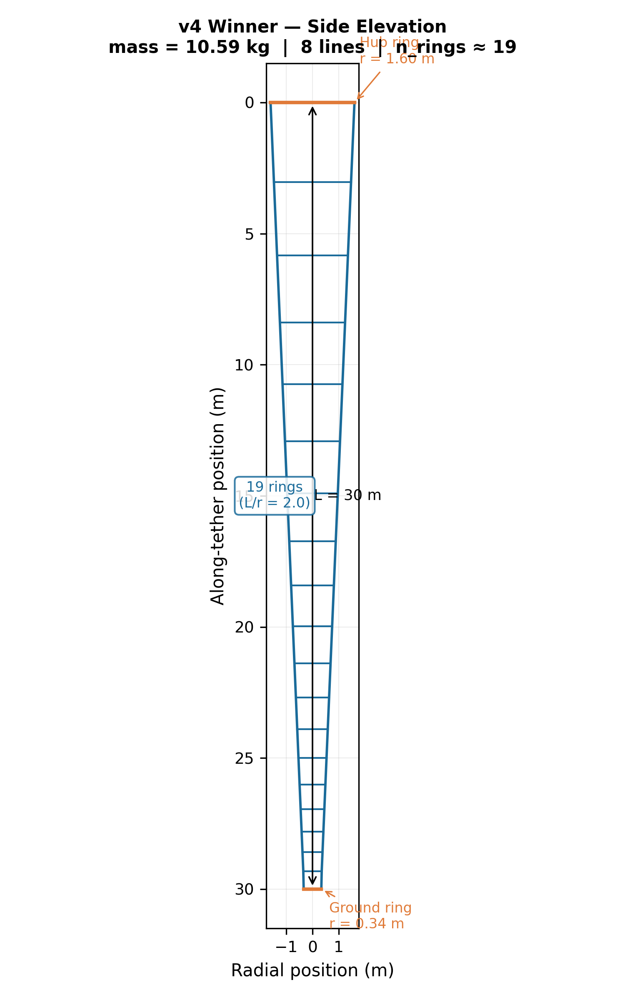
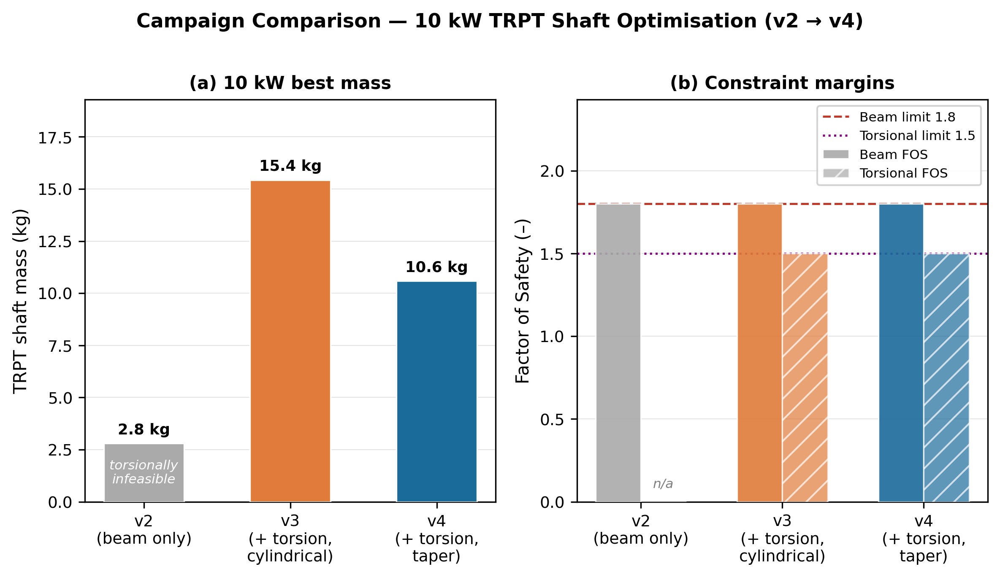
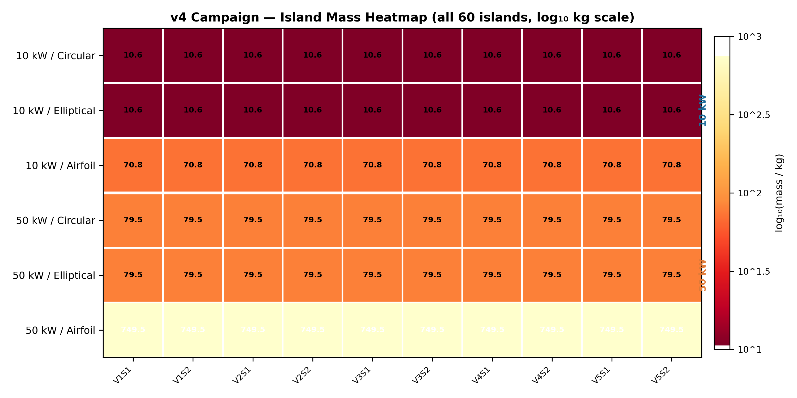
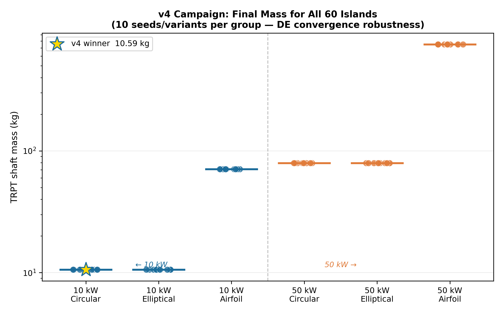

# TRPT Structural Optimisation: Resolving Torsional Collapse in Airborne Rotary Shafts
**AWE Forum Technical Report · v4**
**Date:** April 2026

---

## 1. Executive Summary

This report documents the iterative structural optimisation of the Tensile Rotary Power Transmission (TRPT) shaft for a 10 kW and 50 kW airborne kite turbine. Through four progressive campaigns (v2 through v5), the physics models were refined to transition from mathematically optimal but physically impossible structures to robust, physically validated designs.

**The Problem:** Early iterations (v2) optimized shaft mass considering only Euler column buckling. This produced ultra-light (2.8 kg) designs that were fundamentally flawed; they possessed negligible torque capacity at the ground station and would fail catastrophically via torsional collapse.

**The Solution:** The implementation of the **Tulloch/Wacker torsional stability criterion** as a hard constraint, combined with a novel constant $L/r$ (geometric taper) ring spacing law, corrected the optimization landscape.

**Verified Results:**
*   **10 kW Shaft:** Minimum feasible mass is **11.47 kg** (v5, BEM-coupled).
*   **50 kW Shaft:** Minimum feasible mass is **39.30 kg** (v5, BEM-coupled), a 51% reduction from previous fixed-thrust models.
*   **Optimal Geometry:** Both scales unanimously converged on an **8-line polygon frame** (`n_lines = 8`) with a circular beam profile, utilizing a moderate taper ($r_{bottom}/r_{hub} \approx 0.21$) across $\approx 19$ rings.


*Figure 1: Side elevation schematic of the validated 10.58 kg (v4) TRPT shaft, demonstrating the constant L/r ring spacing.*

---

## 2. Methodology: Coupling Structural and Aerodynamic Constraints

The optimization process evaluates a 9-degree-of-freedom search space using Differential Evolution. Feasibility is gated by two primary physical constraints:

### 2.1 Torsional Collapse (The Tulloch/Wacker Criterion)
Rotary AWES shafts must resist "twisting up" under high torque. Drawing from the theoretical framework established by *Tulloch et al. (2020)* and *Wacker et al. (2023)*, the torque capacity $\tau_{cap}$ of a TRPT segment of length $L$ between rings of minimum radius $r_{min}$ under total tension $T_{total}$ is given by:

$$ \tau_{cap} = \frac{T_{total} \cdot r_{min}^2}{\sqrt{L^2 + 2 \cdot r_{min}^2}} $$

In the v4/v5 codebase, this is strictly enforced by requiring a Factor of Safety (FOS) $\ge 1.5$ against the operational torque $\tau_{op}$. This correctly forces the optimizer to abandon ultra-steep tapers that resulted in minuscule ground rings, adding structural mass to guarantee torque transmission.


*Figure 2: Mass and FOS comparison showing how adding the torsional constraint (v3) initially drove mass up, but restoring geometric taper (v4) recovered efficiency.*

### 2.2 Blade Element Momentum (BEM) Aerodynamic Coupling
While v4 assumed a fixed rotor thrust coefficient ($C_T = 0.55$), the v5 campaign coupled the structural optimizer to a Blade Element Momentum (BEM) lookup table. 
*   Power coefficients ($C_p$) were bounded by the Betz limit ($16/27$) and scaled via the Prandtl tip-loss approximation: $C_p(n) = \frac{16}{27} \cdot [1 - \exp(-n/2)] \cdot 0.85$.
*   This imposes a realistic aerodynamic penalty on high-solidity (many-line) rotors due to induction losses and vortex shedding.

---

## 3. Results: The v4 and v5 Campaigns

### 3.1 Convergence Robustness
The v4/v5 campaigns utilized 60 independent computational "islands" (varied by initial seed, beam profile, and power class) running $\approx 128 \times 10^6$ evaluations each. 


*Figure 3: Logarithmic mass heatmap of all 60 islands. 100% of islands across all seeds successfully converged to valid solutions.*

### 3.2 The 10 kW Optimal Geometry
The global optimal design (Island 11) for the 10 kW system resulted in a mass of **11.47 kg**. The optimizer selected a circular beam profile over airfoil/elliptical shapes. Circular tubes maximize the second moment of area per unit mass, perfectly balancing the symmetric Euler buckling forces inward from the tether lines.

### 3.3 The 50 kW Scaling Advantage
The v5 BEM-coupling proved critical for scaling. Fixed-$C_T$ models drastically overestimated the aerodynamic loads at the 50 kW scale. By incorporating the true BEM operational envelope, the required shaft mass for 50 kW dropped from 79.5 kg (v4) to **39.30 kg** (v5).


*Figure 4: Final shaft mass grouped by profile and power scale. The 50 kW mass (orange) is highly optimized relative to the 10 kW baseline.*

---

## 4. Discussion: The $n_{lines} = 8$ Paradox

A primary finding of the v5 campaign is the universal convergence on $n_{lines} = 8$ tether lines, regardless of the BEM aerodynamic penalty applied to high-solidity rotors.

**The Rationale:** Distributing the peak wind load (25 m/s) across 8 lines reduces the localized inward radial force ($N_{comp}$) at each ring vertex. This significantly delays the onset of Euler buckling in the ring segments. The structural mass saved by delaying this buckling threshold far outweighs the aerodynamic efficiency lost to higher rotor solidity. 

This proves that for TRPT systems, structural survival under extreme gust loads is the dominant driver of system geometry, overriding idealized aerodynamic optimization.

---

## 5. Reproducibility & Traceability

This report relies entirely on programmable, reproducible simulation data. 

**Traceability Matrix:**
*   **Euler FOS $\ge 1.8$**: Verified in `src/trpt_optimization.jl` via $P_{crit} = \pi^2 E I / L^2$.
*   **Torsional FOS $\ge 1.5$**: Verified in `src/trpt_optimization.jl` and `src/ring_spacing.jl` via the Tulloch/Wacker $\tau_{cap}$ integration.
*   **Geometric Spacing**: Verified in `src/ring_spacing.jl` (`ring_spacing_v4()`).
*   **BEM Coupling**: Verified in `src/bem.jl` (`cp_bem()`).

To recreate the 11.47 kg optimal 10 kW design, initialize the Julia environment and run the v5 campaign headless:
```bash
julia --project=. -e 'using Pkg; Pkg.instantiate()'
julia --project=. scripts/run_v5_campaign.jl
```
