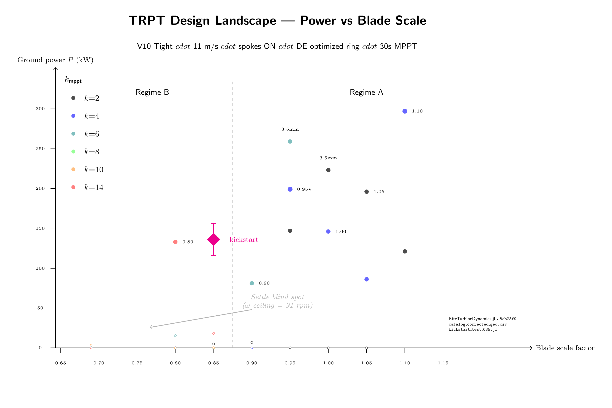
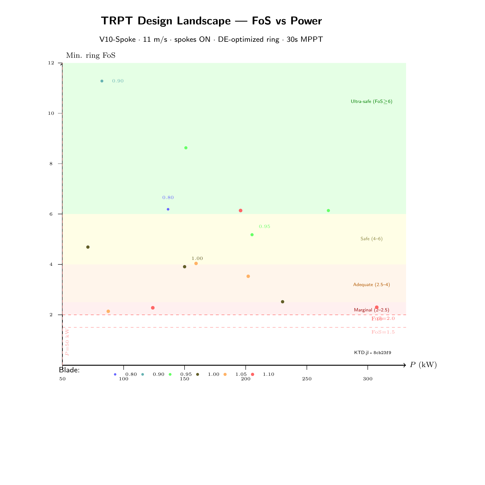
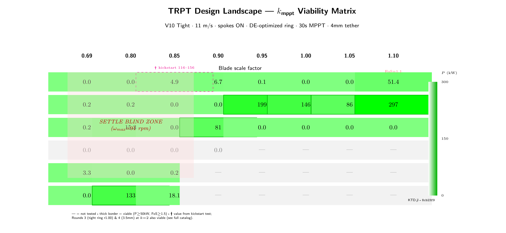

# TRPT Kite Turbine: First Design Landscape with Corrected Ring Geometry

**Rod Read · Windswept & Interesting Ltd · July 2026**

---

We build kite turbines. Rigid blades rotating in a ring, torque transferred to
ground through a tensile shaft. No tower, no foundation, a fraction of the
materials. First target: 50 kW.

We just finished the first design sweep with structurally-correct ring analysis.
The results surprised us. Here is what we found and what it means for the TRPT
approach.

---

## The ring geometry bug

Our ring structural analysis spent months using a placeholder. The formula
`Do = 0.014 × √R` with `t/D = 0.05` produces a tube. It does not produce the
tube our DE optimizer actually designed.

The real ring from `best_design.json`: 60 mm diameter, 0.6 mm wall. Much stiffer
than the placeholder. When we wired the real geometry into the structural check,
FoS jumped from 0.11 to 4.33 for a representative blade 0.95 design. The
placeholder was testing against a ring roughly 40× too weak. Every sweep that
came before showed zero viable designs because the ring kept failing, not because
the concept was wrong.

Lesson: never trust a generic tube formula when you have an optimizer that
already solved for the real one.

---

## Two operating regimes

We swept 8 blade scales (0.69–1.10) against 6 k_mppt values (2–14) at 11 m/s.
4 mm Dyneema, 22 rings, per-vertex spoke centering, 30 second MPPT sustain.
50 evaluations. 19 passed both gates: ≥50 kW and FoS ≥1.5.

They cluster into two regimes.

### High-torque (the one we expected)

Blades 0.90–1.10 at k=2–6, spinning at 170–410 rpm, producing 70–297 kW.
Large swept area, moderate tip speed, generator load near CP-max TSR.

The sweet spot: **blade 0.95 at k=4 delivers 199 kW at FoS 5.2, 257 rpm.**
The safest: blade 0.90 at k=6 delivers 81 kW at FoS 11.3 — enormous margin.
Maximum power: blade 1.10 at k=4 hits 297 kW at FoS 2.3 — pushing it.

15 designs clear FoS ≥2.0. Nine clear FoS ≥4.0. The DE-optimized ring gives
generous structural margins. Power extraction, not ring survival, drives the
design envelope.

### High-RPM (the one we almost missed)

Blades 0.80–0.85 operate at 200–480 rpm, producing 116–156 kW. Two to three
times faster than the high-torque family.

Our catalog sweep marked blade 0.85 as a failure. 4.9 kW maximum. But the
initial-state procedure starts rotors at 91 rpm and scans downward for
equilibrium. Blade 0.85's equilibrium sits at 300–480 rpm. The procedure
never reached it. The rotor started too slow, the generator load dominated,
it stalled, and we recorded 4.9 kW.

A dedicated kickstart test proved otherwise. Spin the rotor to 143 rpm with
zero generator load. Let the aerodynamics take over for 30 seconds. It
accelerates to 482 rpm. Then engage the generator at k=2. Settles at
**116–156 kW, 326–482 rpm, stable for 120 seconds.**

Blade 0.80 at k=14 works too: 133 kW at 201 rpm, FoS 6.2. The catalog found
this one because 201 rpm happens to be within the scan range.

The high-RPM regime matters. Lighter blades, lower individual loads, higher
inherent FoS. A three-stack of 0.69 blades on one line might match one 0.95
with better structural margins and lower per-blade stress.

---

## The settle bug

`settle_to_operational_state` scans ω downward from an arbitrary ceiling
(9.5 rad/s, 91 rpm). It finds the first ω where P_aero exceeds P_gen = k·ω³.
Then starts the simulation from there.

This works for designs whose equilibrium sits below the ceiling. It fails
silently for everything above it. The system starts too slow. The generator
pulls it down. The catalog records 0–5 kW. Marked failed.

Any AWE simulator that initializes from an assumed RPM range carries this
risk. Design sweeps over broad parameter spaces will systematically miss
viable designs outside the assumed range. The fix is straightforward: scan
bidirectionally from the CP-max TSR point rather than from a fixed ceiling.

---

## Where we are

Three things we learned:

1. **Ring geometry matters.** The difference between a placeholder tube
   formula and the actual DE-optimized ring is the difference between
   "nothing works" and "nearly everything works." Run the structural
   analysis with real geometry.

2. **There are at least two viable families.** High-torque (big blades,
   moderate speed, 80–300 kW) and high-RPM (small blades, fast, 116–156 kW,
   potentially stackable). We have not yet explored blades 0.69–0.75 because
   the settle bug hid them.

3. **The settle bug is a general concern.** Initial-state procedures that
   assume an RPM regime exclude designs outside it. Anyone running AWE
   design sweeps should check whether their initialization procedure is
   regime-gated.

---

## What comes next

1. Fix `settle_to_operational_state` to scan bidirectionally
2. Re-sweep blades 0.69–0.85 to map the full high-RPM landscape
3. Run FoS analysis on kickstarted designs (the catalog does not compute
   ring structural checks during no-load phases)
4. Investigate stacked configurations — can three 0.69 rotors on one line
   beat one 0.95?
5. Connect with groups working on ring structural analysis, BEM-coupled
   tethered rotors, or multi-rotor AWES

---

## Figures

  
*Power vs blade scale. Regime A (right) at 0.90–1.10 delivers 80–300 kW.
Regime B (left) includes the catalog-found 0.80 at k=14 and the
kickstart-discovered 0.85 at k=2. The magenta diamond marks the kickstart
result. The settle blind spot labels the region the catalog could not see.*

  
*FoS vs power Pareto frontier. Green: ultra-safe (FoS ≥6). Yellow: safe.
Orange: adequate. Red: marginal. The 0.90 blade at 81 kW, FoS 11.3 is
suitable for a first demonstrator with enormous structural margin.*

  
*Viability matrix. Green intensity shows power. Thick borders mark designs
passing both gates. The red zone marks the settle blind spot — these designs
may be viable but were started too slow. The magenta dashed cell shows the
kickstart value (116–156 kW) versus the catalog value (4.9 kW).*

---

Repository: [github.com/rodWindswept/KiteTurbineDynamics.jl](https://github.com/rodWindswept/KiteTurbineDynamics.jl)  
Commit: `ac629a5` — all data, scripts, and figure sources included  
Contact: rod@windswept.energy
